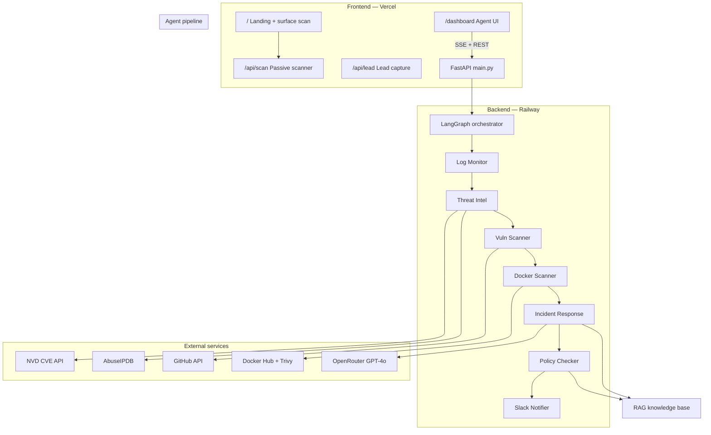

# Secure Total Scan

[](https://github.com/dheerajrvanteru/securetotalscan/actions/workflows/ci.yml)

> If it's online, it can leak. Find out before someone else does.

Security for anything exposed to the internet: websites, apps, GitHub repos, Docker Hub images, and log files. A **free passive surface scan** gives an instant A–F grade; a **seven-agent deep-analysis engine** finds threats, vulnerabilities, and compliance gaps with copy-paste fix prompts.

| Layer | Stack | Deploy |
| --- | --- | --- |
| **Frontend** | Next.js 15, React 19, Tailwind | [Vercel](https://securetotalscan.vercel.app) |
| **Backend** | FastAPI, LangGraph, OpenRouter | [Railway](https://cybersentinel-api-production.up.railway.app) |

---

## System architecture



### Request flow (deep analysis)

1. User starts a scan from `/dashboard` (GitHub repo, Docker image, logs, or upload).
2. Frontend calls `POST /analyze`, `/analyze/github`, `/analyze/docker`, or `/analyze/upload` on the backend.
3. FastAPI creates a session, queues LangGraph in a background thread, returns `session_id`.
4. Browser subscribes to `GET /stream/{session_id}` (SSE) for live agent progress.
5. When the pipeline completes, frontend fetches `GET /report/{session_id}` and `GET /evals/{session_id}`.

All agents share one **`SecurityState`** object (blackboard pattern). Each agent reads prior fields and returns an updated copy; LangGraph merges state forward.

---

## Frontend architecture

```
securetotalscan/
├── app/
│   ├── page.tsx              # Marketing landing + free surface scan
│   ├── dashboard/page.tsx    # Agent dashboard (SSE, results, RAG panel)
│   ├── api/scan/route.ts     # Passive scanner API (no LLM)
│   └── api/lead/route.ts     # GoHighLevel lead capture
├── components/               # ScanForm, ScanResults, landing sections
├── lib/
│   ├── scanner/              # Passive surface scanner (headers, CORS, secrets, probes)
│   ├── api.ts                # Typed client for FastAPI backend
│   ├── content.ts            # Marketing copy
│   └── brand.ts              # Brand constants
└── vercel.json
```

### Surface scanner (free tier)

Runs entirely in Next.js — no agent backend required.

| Module | Role |
| --- | --- |
| `lib/scanner/fetcher.ts` | Safe HTTP fetch with SSRF guards |
| `lib/scanner/checks.ts` | Header, CORS, SSL, auth, input validation |
| `lib/scanner/secrets.ts` | Hardcoded secrets in HTML/JS bundles |
| `lib/scanner/probes.ts` | Active probes for exposed paths/files |
| `lib/scanner/score.ts` | A–F grading |

Each finding includes a **copy-paste fix prompt** for AI-assisted remediation.

### Agent dashboard

| Feature | Implementation |
| --- | --- |
| Scan modes | GitHub repo, Docker Hub image, synthetic/system logs, file upload |
| Live progress | `EventSource` → `GET /stream/{session_id}` |
| Results | Anomalies, CVEs, vulns, Docker findings, compliance gaps, RAG sources |
| Evals tab | Token cost, cache hit rate, per-agent latency |
| API client | `lib/api.ts` — `NEXT_PUBLIC_API_URL` points to Railway |

---

## Backend architecture

```
backend/
├── main.py                 # FastAPI routes, SSE, session lifecycle
├── orchestrator.py         # LangGraph linear pipeline + agent wrappers
├── state.py                # SecurityState TypedDict contract
├── session_events.py       # SSE event queues (observer pattern)
├── session_evals.py        # Per-session metrics API
├── llm_client.py           # CachingLLMClient (OpenRouter adapter)
├── llm_cache.py            # LRU cache-aside for LLM calls
├── agents/                 # One module per agent (pure node functions)
├── tools/                  # Reusable parsers log_parser, github_scanner, nvd_api, rag, docker_scanner
├── data/knowledge/         # RAG knowledge chunks (NIST, SOC2, ISO, OWASP, Docker)
├── nixpacks.toml           # Railway build (Python + Trivy)
├── railway.toml            # Railway config-as-code
└── tests/                  # 65 pytest tests
```

### API endpoints

| Method | Path | Purpose |
| --- | --- | --- |
| POST | `/analyze` | Start log analysis (`synthetic` \| `system`) |
| POST | `/analyze/upload` | Upload `.log` / `.txt` (max 10 MB) |
| POST | `/analyze/github` | GitHub static analysis |
| POST | `/analyze/docker` | Docker Hub image scan (Trivy CVEs) |
| GET | `/stream/{session_id}` | SSE agent progress |
| GET | `/report/{session_id}` | Full pipeline report |
| GET | `/evals/{session_id}` | Token/cost/cache metrics |
| GET | `/health/trivy` | Trivy install + DB readiness |

---

## Agent pipeline

Seven agents run **sequentially** in a fixed LangGraph graph. Order is defined in `orchestrator.py` — predictable for demos and tests.

```
log_monitor → threat_intel → vuln_scanner → docker_scanner
           → incident_response → policy_checker → slack_notifier
```

Each agent is wrapped with `_wrap()` for SSE events (`running` / `done` / `error`), latency tracking, and centralized error handling.

### 1. Log Monitor (`agents/log_monitor.py`)

| | |
| --- | --- |
| **Type** | Deterministic (regex) |
| **Input** | `raw_logs` |
| **Output** | `anomalies`, `severity_map` |
| **Detects** | SSH brute force (≥3 failures/IP), port scans, path traversal, sudo failures |
| **Tool** | `tools/log_parser.py` |

### 2. Threat Intel (`agents/threat_intel.py`)

| | |
| --- | --- |
| **Type** | External API |
| **Input** | `anomalies` |
| **Output** | `cve_matches`, `threat_score` (0–100) |
| **Tools** | `tools/nvd_api.py` (NVD CVE lookup), `tools/abuseipdb.py` (IP reputation) |

### 3. Vulnerability Scanner (`agents/vuln_scanner.py`)

| | |
| --- | --- |
| **Type** | Deterministic + HTTP |
| **Input** | `anomalies`, optional `github_repo`, optional `target_url` |
| **Output** | `vulnerabilities`, `code_findings`, `risk_level` |
| **Checks** | OWASP mapping from log anomalies, GitHub static scan (secrets, SQLi, Terraform), HTTP security headers (when `target_url` set) |
| **Tool** | `tools/github_scanner.py` |

### 4. Docker Scanner (`agents/docker_scanner.py`)

| | |
| --- | --- |
| **Type** | External API + Trivy |
| **Input** | `docker_image` (optional — skips if empty) |
| **Output** | `docker_findings`, `docker_trivy_cve_count`, merges into `vulnerabilities` |
| **Checks** | Docker Hub metadata (`:latest` tag, stale images, low-trust images), **Trivy CVE scan** |
| **Tool** | `tools/docker_scanner.py` |

### 5. Incident Response (`agents/incident_response.py`)

| | |
| --- | --- |
| **Type** | LLM (cached) |
| **Model** | `openai/gpt-4o` via OpenRouter |
| **Input** | All prior findings + **RAG-retrieved knowledge** |
| **Output** | `action_plan`, `runbook_md`, `retrieved_sources` |
| **Fallback** | Deterministic remediation steps when LLM fails or API key missing |
| **Cache** | `CachingLLMClient` + `LLMCache` (SHA-256 key, LRU 256 entries) |

### 6. Policy Checker (`agents/policy_checker.py`)

| | |
| --- | --- |
| **Type** | Rule-based + RAG |
| **Input** | `anomalies`, `code_findings`, `docker_findings` |
| **Output** | `compliance_gaps`, `compliance_score`, `retrieved_sources` |
| **Frameworks** | NIST CSF 2.0, SOC 2 Type II, ISO 27001 |
| **Tool** | `tools/rag.py` (keyword retrieval over `data/knowledge/chunks.json`) |

### 7. Slack Notifier (`agents/slack_notifier.py`)

| | |
| --- | --- |
| **Type** | External webhook |
| **Input** | Full state + optional `slack_webhook_url` |
| **Output** | `slack_sent`, `slack_error` |
| **Behavior** | Skips silently when no webhook; never fails the pipeline |

---

## RAG (Retrieval-Augmented Generation)

RAG connects static security knowledge to LLM and compliance agents.

```
Findings (anomalies, CVEs, code/docker issues)
        ↓
  build_query_from_state()
        ↓
  retrieve_context()  — keyword overlap over 14 knowledge chunks
        ↓
  Incident Response prompt  +  Policy Checker compliance refs
        ↓
  Dashboard "Retrieved knowledge (RAG)" panel
```

Knowledge base: `backend/data/knowledge/chunks.json` — NIST, SOC 2, ISO 27001, OWASP, CIS Docker, incident response playbooks.

Implementation: `backend/tools/rag.py` (no vector DB required; lightweight and offline-testable).

---

## Configuration

### Frontend (`.env.local`)

| Variable | Purpose |
| --- | --- |
| `NEXT_PUBLIC_API_URL` | Railway backend URL (required for `/dashboard`) |
| `GHL_API_TOKEN` | GoHighLevel lead capture (optional) |
| `RESEND_API_KEY` | Email reports (optional) |

### Backend (`backend/.env`)

| Variable | Required | Purpose |
| --- | --- | --- |
| `OPENROUTER_API_KEY` | Recommended | LLM incident response |
| `GITHUB_TOKEN` | Recommended | GitHub API rate limits |
| `NVD_API_KEY` | Optional | NVD CVE API |
| `ABUSEIPDB_API_KEY` | Optional | IP reputation |
| `TRIVY_PATH` | Optional | Trivy binary (auto-detected) |
| `TRIVY_WARMUP` | Optional | Pre-download vuln DB on startup (`true`) |

See `backend/.env.example` for full Trivy tuning vars.

### Deploy config

| File | Platform | Purpose |
| --- | --- | --- |
| `vercel.json` | Vercel | Next.js framework |
| `backend/nixpacks.toml` | Railway | Python 3.11 + Trivy install at build |
| `backend/railway.toml` | Railway | Railpack builder, health check on `/health/trivy` |
| `backend/Dockerfile.trivy` | Railway (alt) | Docker-based deploy with Trivy |

**Railway setup:** Root Directory = `backend`, Config file = `/backend/railway.toml`.

**Vercel setup:** Set `NEXT_PUBLIC_API_URL=https://your-railway-url.up.railway.app`, then redeploy.

---

## Quick start

```bash
# Frontend
npm install
cp .env.example .env.local          # set NEXT_PUBLIC_API_URL=http://localhost:8000
npm run dev                         # http://localhost:3000

# Backend (second terminal)
cd backend
python -m venv .venv && source .venv/bin/activate
pip install -r requirements.txt
./scripts/install-trivy.sh          # optional: Docker CVE scanning
cp .env.example .env
uvicorn main:app --reload --port 8000
```

---

## Testing

CI runs on every push/PR to `main`/`master`:

| Job | Command | Coverage |
| --- | --- | --- |
| **Web** | `npm run typecheck`, `npm run build`, `npm run verify:scanner` | TypeScript + Next.js build + scanner logic |
| **Backend** | `pytest tests/ -q` | 65 unit/integration agents, tools, API, RAG, Docker, cache |

```bash
# Local — frontend
npm run typecheck
npm run build
npm run verify:scanner

# Local — backend
cd backend && python -m pytest tests/ -q
```

---

## Project structure

```
securetotalscan/
├── app/                    # Next.js App Router
├── components/             # React UI
├── lib/                    # Scanner, API client, content
├── backend/                # FastAPI + LangGraph agents
│   ├── agents/             # Pipeline agents
│   ├── tools/              # Shared capabilities
│   ├── data/knowledge/     # RAG chunks
│   └── tests/              # pytest suite
├── docs/                   # Attribution, integration notes
└── .github/workflows/ci.yml
```

---

## Data promise

Files and logs uploaded for analysis are encrypted in transit, processed in memory, and discarded when the scan ends. Nothing is persisted; nothing trains a model.

---

## License

[MIT](LICENSE) for the original web code. Backend is subject to its upstream license — see [docs/ATTRIBUTION.md](docs/ATTRIBUTION.md).
