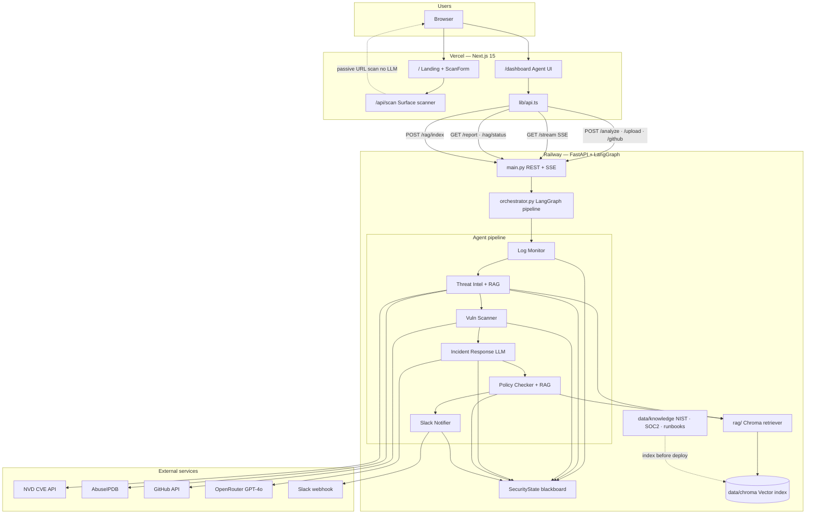

# Secure Total Scan

> If it's online, it can leak. Find out before someone else does.

Security for anything exposed to the internet: any website, app, GitHub repo, or
log file. A free passive surface scan gives an instant A–F grade; a five-agent
deep-analysis engine goes inside the code and logs for threats, vulnerabilities,
and compliance gaps. Every finding ships with a copy-paste fix prompt.

This repo is the integrated Rev 2 build (web + agent backend).

---

## Architecture



### How the layers connect

| Layer | Entry point | Runtime | Output |
|-------|-------------|---------|--------|
| **Surface scan** | `/` → ScanForm | Next.js `/api/scan` | A–F grade, fix prompts |
| **Deep analysis** | `/dashboard` | Railway LangGraph agents | Threat report, policies, runbook |
| **RAG knowledge** | Pre-indexed Chroma | Threat Intel + Policy Checker | NIST/SOC2 controls, runbooks |

**Deploy split:** frontend on [Vercel](https://frontend-pearl-five-55.vercel.app), backend on [Railway](https://cybersentinel-api-production.up.railway.app). The dashboard reaches the backend via `NEXT_PUBLIC_API_URL`. See [docs/DEPLOY.md](docs/DEPLOY.md).

---

## Structure

```
securetotalscan/
├── app/            # Next.js routes: marketing landing (/) + agent dashboard (/dashboard)
├── components/     # UI: scan form, results, landing sections
├── lib/
│   ├── scanner/    # free passive surface scanner (original, no LLM)
│   ├── api.ts      # client for the agent backend
│   ├── content.ts  # all marketing copy
│   └── brand.ts    # name, email, URL, copyright (single source of truth)
├── backend/        # FastAPI + LangGraph agent engine (see backend/README.md)
├── docs/           # attribution, specs, deployment notes
└── public/
```

- **Web** (this root): Next.js 15, deploys to Vercel.
- **Backend** (`/backend`): FastAPI + LangGraph, deploys to Railway. Pulled from
  the upstream agent repo, see [backend/README.md](backend/README.md) and
  [docs/ATTRIBUTION.md](docs/ATTRIBUTION.md).

## Two layers of scanning

| Layer | What | Where |
| --- | --- | --- |
| Free surface scan | Headers, secrets, CORS, SSL, exposed files → A–F grade | `lib/scanner/`, runs in `/api/scan` |
| Deep agent analysis | Log monitor, threat intel, vuln scanner, incident response, compliance + LLM cost control | `/backend`, streamed to `/dashboard` |

## Quick start

```bash
# Web
npm install
cp .env.example .env.local      # set NEXT_PUBLIC_API_URL
npm run dev                     # http://localhost:3000

# Backend (in a second terminal) — see backend/README.md to pull the code first
cd backend && python -m uvicorn main:app --reload --port 8000
```

## Verify

```bash
npm run typecheck
npm run build
npm run verify:scanner          # offline check of the surface scanner logic
```

## Deploy

Production is split across Vercel (web) and Railway (agent backend). See [docs/DEPLOY.md](docs/DEPLOY.md) for full setup.

| Service | URL |
|---------|-----|
| Frontend | https://frontend-pearl-five-55.vercel.app |
| Dashboard | https://frontend-pearl-five-55.vercel.app/dashboard |
| Backend API | https://cybersentinel-api-production.up.railway.app |

- **Web → Vercel:** set `NEXT_PUBLIC_API_URL` to the Railway URL above.
- **Backend → Railway:** root directory `backend/`. Add `OPENROUTER_API_KEY`, `GITHUB_TOKEN`, etc.
- **RAG index:** run `python -m scripts.index_knowledge` before deploy, or re-index from the dashboard.

Marketing funnel + payments → GoHighLevel + Stripe (commercial tier).

## Data promise

Files and logs uploaded for analysis are encrypted in transit, processed in
memory, and discarded when the scan ends. Nothing is persisted; nothing trains a
model. See the trust section on the landing page.

## License

[MIT](LICENSE) for the original web code. Backend is subject to its upstream
license, see [docs/ATTRIBUTION.md](docs/ATTRIBUTION.md).
